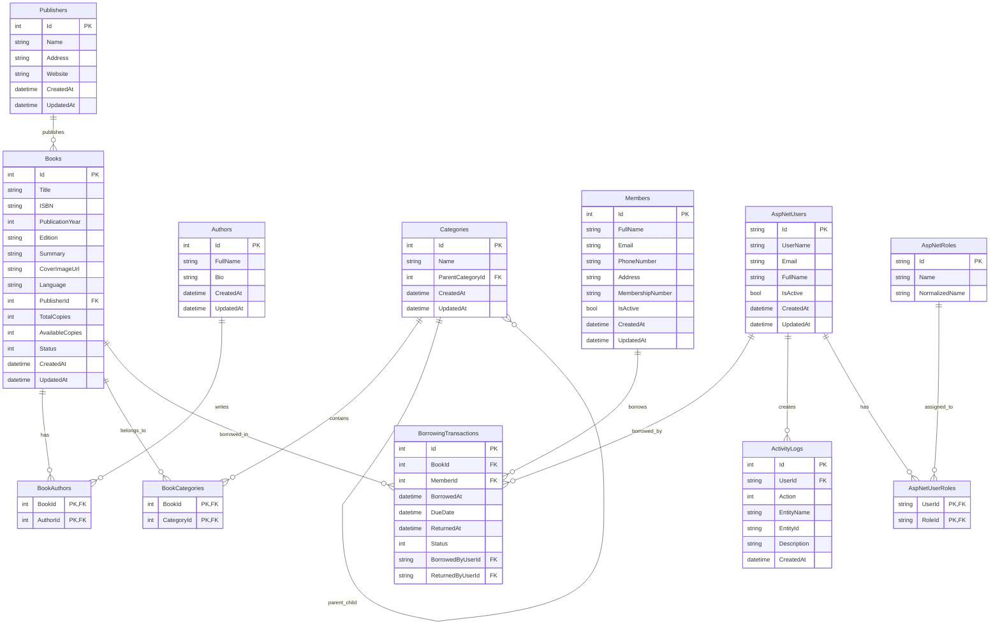

# Entity Relationship Diagram

This file describes the database relationships for the Library Management System.

The ERD is written using Mermaid syntax and can be rendered directly on GitHub.

---

## ERD



---

## Relationship Summary

### Books and Publishers

Each book has one publisher.

Each publisher can publish many books.

```text
Publisher 1 ---- * Books
```

---

### Books and Authors

A book can have multiple authors.

An author can write multiple books.

This is handled using the `BookAuthors` join table.

```text
Books * ---- * Authors
```

---

### Books and Categories

A book can belong to multiple categories.

A category can contain multiple books.

This is handled using the `BookCategories` join table.

```text
Books * ---- * Categories
```

---

### Category Hierarchy

Categories support parent-child relationships.

Example:

```text
Technology
└── Programming
```

This is handled by:

```text
Categories.ParentCategoryId
```

---

### Members and Borrowing Transactions

A member can borrow many books.

Each borrowing transaction belongs to one member and one book.

```text
Member 1 ---- * BorrowingTransactions
Book   1 ---- * BorrowingTransactions
```

---

### System Users and Borrowing Transactions

System users perform borrowing and returning actions.

The transaction stores:

```text
BorrowedByUserId
ReturnedByUserId
```

These values reference Identity users.

---

### System Users and Roles

System users are handled by ASP.NET Core Identity.

Roles are handled using:

```text
AspNetUsers
AspNetRoles
AspNetUserRoles
```

---

### Activity Logs

Activity logs track important system actions.

Each log stores:

```text
UserId
Action
EntityName
EntityId
Description
CreatedAt
```

Only administrators can view activity logs.